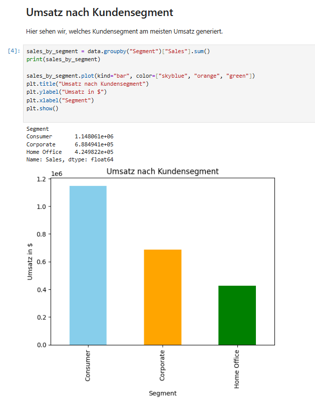

# Superstore Sales Analysis

## Projektübersicht
Dieses Projekt analysiert Verkaufsdaten des fiktiven Superstore-Datasets.  
Ziel ist es, **Datenanalysen und Visualisierungen** durchzuführen, um wichtige Insights über Kunden, Produkte und Umsatztrends zu gewinnen.  

## Inhalt des Repositories
- `notebooks/Superstore_Analysis.ipynb` – Das komplette Jupyter Notebook mit allen Analysen und Plots  
- `data/superstore.csv` – Rohdaten  
- `outputs/` – Exportierte Ergebnisse (z. B. Umsatz nach Segment, Kategorie, Sub-Category, Umsatz über Zeit)  
- `README.md` – Diese Projektbeschreibung  

## Analysen im Notebook
1. **Überblick über die Daten**  
   - Struktur, Datentypen, fehlende Werte
2. **Umsatz nach Kundensegment**  
   - Consumer, Corporate, Home Office
3. **Umsatz nach Region**  
   - South, West, Central, East
4. **Umsatz nach Kategorie & Sub-Category**  
   - Furniture, Office Supplies, Technology  
   - Unterkategorien z. B. Chairs, Phones, Binders
5. **Umsatz über die Zeit**  
   - Monatliche Trends, Saisonalität

## Insights
- Das Segment **Consumer** generiert den höchsten Umsatz (~1,15 Mio $)  
- Die umsatzstärkste Region ist **West**  
- Die Kategorie mit dem höchsten Umsatz ist **Technology**  
- Die Sub-Category mit dem höchsten Umsatz ist **Phones**  
- Umsatz über die Zeit zeigt saisonale Peaks, z. B. zum Jahresende

## Technologien
- Python 3.x  
- Pandas  
- Matplotlib  
- Jupyter Notebook  

## Ziel
Dieses Projekt zeigt praxisnah:
- Datenimport & -bereinigung  
- Exploratory Data Analysis (EDA)  
- Gruppierungen, Aggregationen und Visualisierungen  
- Ableitung von Insights für Geschäftsentscheidungen  

## Autor
**Zulker** – [GitHub Profil](https://github.com/Zulkerr)

## Screenshot

